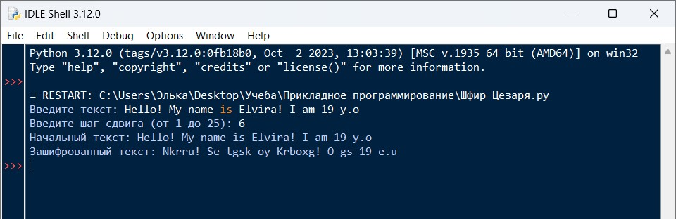

# Лабораторная №5

# Исполнитель
Громова Эльвира  
Группа ФТ-220007

# Задание
Циклы, строки, списки - Шифр Цезаря

Написать на Python программу: шифрование и расшифровка текста шифром Цезаря. Пользователь вводит строку и шаг сдвига. Заглавные символы должны быть заменены заглавными, цифры и знаки препинания оставить без изменения.

# Среда разработки
Язык программирования: Python  
Среда разработки: IDLE

# Инструкция по работе
При открытии файла Шифр Цезаря.py необходимо ввести текст, который хотим зашифровать, далее вводим шаг сдвига.   
Запустить программу, нажав ENTER. При выводе Вы увидите сумму написанную словами.

# Тесты
Выполнение программы

